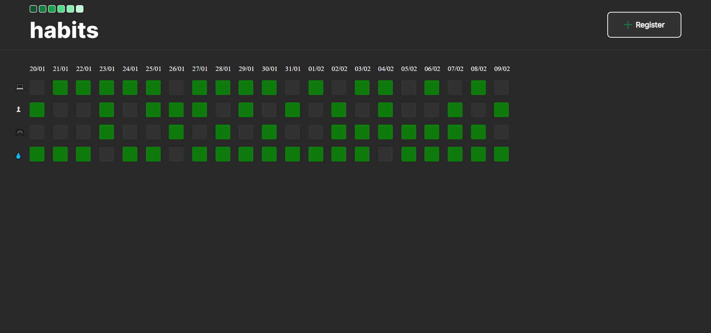

## NLW setup

<h1 align="center"> Habits </h1>

  <a href="#-tecnologias">Technologies</a>&nbsp;&nbsp;&nbsp;|&nbsp;&nbsp;&nbsp;
  <a href="#-projeto">Project</a>&nbsp;&nbsp;&nbsp;|&nbsp;&nbsp;&nbsp;
  <a href="#-layout">Layout</a>&nbsp;&nbsp;&nbsp;|&nbsp;&nbsp;&nbsp;
  <a href="#memo-licença">License</a>

  

 

  

## 🚀 Technologies

This project was developed with the following technologies:

- HTML e CSS
- JavaScript
- Git e Github
- Figma

## 💻 Project

The Habbits is an application that helps you to register your habits.

- [See this project online](https://danilorua.github.io/nlw-setup/ )

## 🔖 Layout

See the layout of the project in Figma by [CLICKING HERE](https://www.figma.com/file/aZou0G4bOQ8sbSQ02YGpbs/Habits-(e)-(Community)?node-id=75%3A567&t=1K2yk2WI6GBcmGtS-0). Account required to access.

## :memo: License

This project is licensed under the MIT license.
